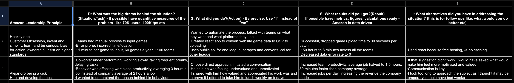

# Amazon Internship Interview Guide

Lots of people ask about Amazon interviews, so I wanted to write up everything I know based on my experience and what I’ve seen from others.

---

## Interview Format (Internship)

For Amazon SDE Intern roles, the typical process is:

- 1 round — 45 to 60 minutes
  - ~2 behavioral questions
  - ~1 Leetcode-style coding question

Behavioral is weighted heavily — I’d estimate it’s about 50% of your performance, so don’t take it lightly or treat it as just a warmup.

---

## Coding Portion

This is a standard Leetcode-style question.

- Ask clarifying questions at the start
- Talk through your thought process
- Explain your solution out loud
- Write correct, clean code
- Discuss time & space complexity
- Consider edge cases and test cases

Most people get an Easy or Easy-Medium difficulty question — but it’s possible to get unlucky with something harder.

---

## Behavioral Portion (STAR Format)

Amazon *loves* STAR (Situation, Task, Action, Result) answers.

> Key Tip: They’re not just looking for any story — they want to see Amazon Leadership Principles in your answers.

### Strategy:
- Recognize which leadership principle(s) the question is targeting
- Aim to touch on multiple principles within your answer if possible
- Include measurable metrics whenever you can (impact, numbers, results)

---

### My Prep Method: STAR Spreadsheet

I personally made a spreadsheet where I:

- Wrote out my STAR stories
- Tagged which Leadership Principles each story hit
- Used bullet points & metrics to jog my memory

This was super helpful during prep.

---

## Resources for Amazon Leadership Principles

Highly recommend reading through these for examples of what Amazon looks for:

- [Amazon Interview Questions & Leadership Principles — DayOne Careers](https://blog.dayone.careers/amazon-interview-questions/)

- [Amazon STAR Stories & Leadership Principles Guide (Google Drive)](https://drive.google.com/file/d/1PtbB6veBmieCeWY-6ejaAlXHAd7GMIbC/view?usp=sharing)

- [Interviewing.io Guide to Amazon Leadership Principles](https://interviewing.io/guides/amazon-leadership-principles)

---

## Offer Timeline

For me, it was very quick — less than a week after the interview.

At the time, Amazon used to send out intern offers on certain days of the week — I think it was:

- Tuesday mornings
- Friday mornings

(Or possibly Wednesday instead of Tuesday — not 100% sure if that’s still true.)

Either way, I received my offer about 3-4 days after my interview.

---

## Final Thoughts

If you’re preparing for Amazon:

- Take the behavioral section seriously — it’s *just* as important as the coding.
- Prepare STAR stories with metrics and tie them to leadership principles.
- Treat the coding round like a conversation, not just a silent Leetcode session.
- Be ready to talk about impact, ownership, learning, and overcoming challenges.

Good luck!
