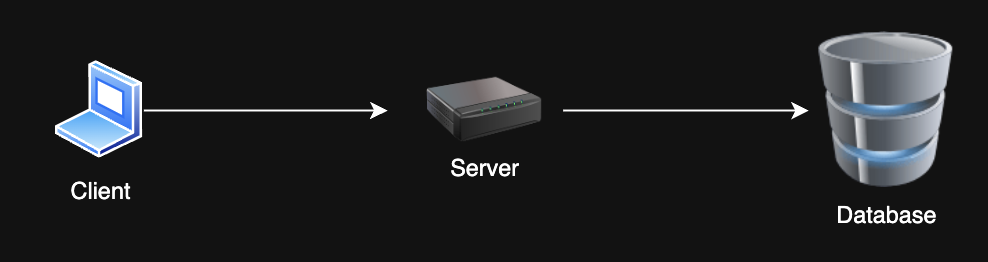
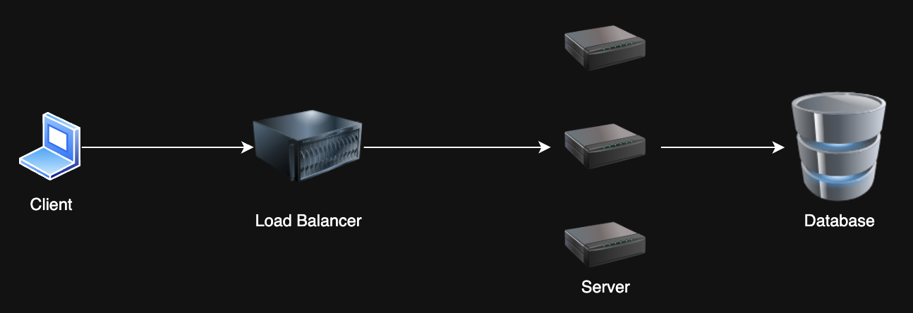
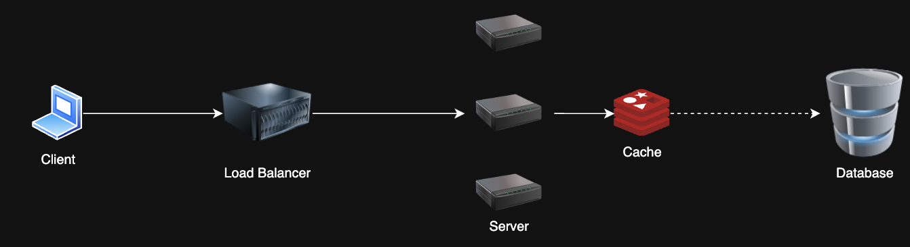
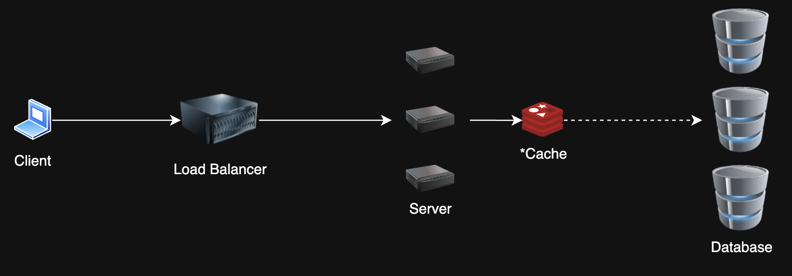
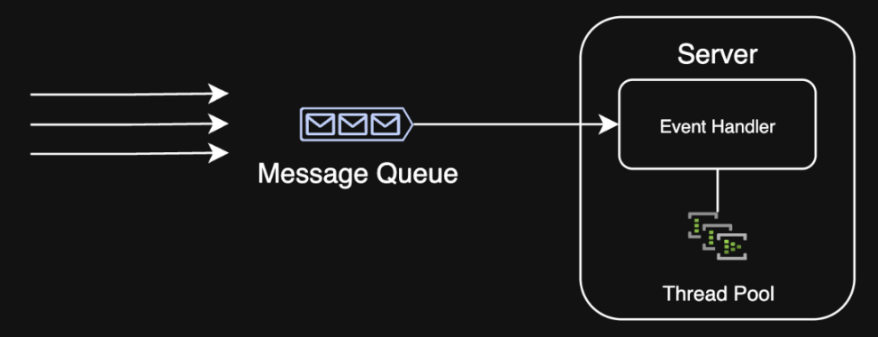
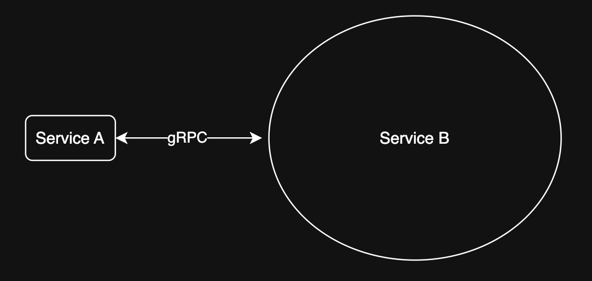
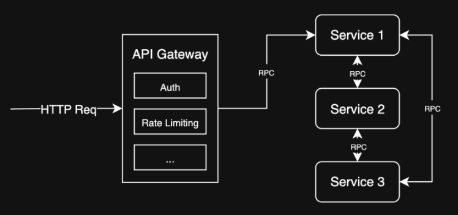
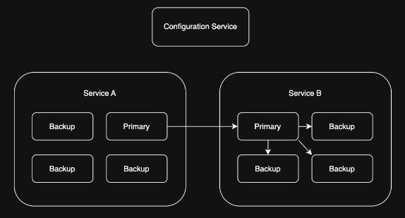
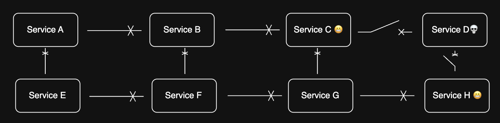

# Patterns for Scalability and Reliability in Systems

This document covers the basic techniques and architectures for solving common scalability and reliability problems in systems.

## Overview

When building modern systems, we need to consider how they'll perform under load and how to maintain reliability. This guide introduces common patterns that help address these challenges, organized into the following sections:

1. Client Server Architecture
2. Scalability Patterns
3. Limitations
4. Extending Client Server Architecture
5. Availability/Reliability Patterns

## Client Server Architecture

The client-server model is the foundation of most web applications and services. Key concepts include:

- Client-server communication
- RESTful API design
- Stateful vs. stateless services

## Scalability Patterns

As systems grow, they face various bottlenecks. Here are common patterns to address these issues:

### 1. Load Balancing

**Problem**: I have too many requests! My single server can't take it anymore 😭

**Solution**: Horizontal scaling with a load balancer -- distribute requests across multiple servers

### 2. Caching

**Problem**: My database is slow and can't handle all these reads 😩

**Solution**: Cache frequently/recently accessed data to reduce database load

### 3. Database Sharding/Partitioning

**Problem**: My database is massive and can't handle all these writes 😭

**Solution**: Split the database into smaller, more manageable pieces. Designate a *partition key* to determine which shard to write to.

### 4. Queueing

**Problem**: My system is overwhelmed by bursty traffic and can't process requests fast enough 😩

**Solution**: Use a message queue to manage requests and process them asynchronously

## Limitations

Even with these patterns, various components have inherent limitations that we need to be aware of:

### SQL Databases

**Problem**: SQL databases have limitations on scalability due to ACID properties 😞

- 1,000 writes/sec - Use more than one instance (sharding)
- 10,000 reads/sec - Use read replicas
- 1 TB (1000 GB) - Use partitioning
- 100 million records - Standard B-tree indexing not as effective

**Solution**: Add replicas, shard, or use a different database

### NoSQL Databases

- Many NoSQL databases scale horizontally and efficiently by default 🥳
- Tradeoff ACID and indexing capabilities for effectively unlimited scalability with the right schema design
- E.g. Cassandra, MongoDB, DynamoDB

### Networks

**Problem**: At scale, network latency and throughput can become a bottleneck 😱

- 50 ms - Good latency over the internet
- 10 ms - Good latency within a data center
- 1 Gbps - Start thinking about multiple servers (or just network interfaces)

**Solution**: Add more servers and route network traffic, use CDNs/edge caching

### Single Hosts

**Problem**: Single hosts have limitations on CPU, memory, and disk I/O 😡

- 100 GB working set of data in memory - Consider sharding or partitioning
- 1 GB data to cache - Consider using a distributed cache
- 10,000 requests/sec - Consider adding more servers

**Solution**: Partition for write-heavy workloads, cache data upstream for read-heavy workloads to decrease requests

## Extending Client Server Architecture

As systems grow more complex, we need to extend beyond basic client-server models:

### Service-Oriented Architecture (SOA)

**Problem**: My monolithic architecture is hard to maintain and scale 😖

**Solution**: Break down the monolith into smaller, more manageable services. Each service is responsible for a specific task and can be scaled independently.

### API Gateway

**Problem**: I have multiple services which are non-uniform, and clients need to access them all 😩

**Solution**: Use an API Gateway to route requests to the appropriate service

## Availability/Reliability Background

Understanding reliability is critical for building robust systems:

- **Availability**: System is operational and accessible
- **Reliability**: System performs as expected under normal conditions

Why do we need a reliable system?

- 99.999% uptime = 5.26 minutes of downtime per year
- With 100 services, each with 99.999% uptime, the system *could* be down for 8.76 hours per year (assuming everything is a single point of failure)

To put it into perspective, AWS EC2's *Service Level Agreement* is 99.99% uptime, which allows for 52.56 minutes of downtime per year.

So building on top of cloud services still requires going the extra mile to ensure reliability.

## Reliability Patterns

Here are key patterns to improve system reliability:

### 1. Replication

**Problem**: I have a stateful, purpose-built service that needs to be highly available 😅

**Solution**: Primary forwards writes to replicas, which can take over if the primary fails

### 2. Circuit Breaker

A circuit breaker helps isolate failures to prevent them from cascading through your system:

- Prevents system failures from cascading
- Monitors and isolates failing components

### 3. Graceful Degradation

Design systems to maintain (at least) partial functionality during failures:
- If a service is down, show cached data
- If a service is overloaded, timeout gracefully and retry later

Limit hard dependencies and keep services decoupled to enable this resilience.